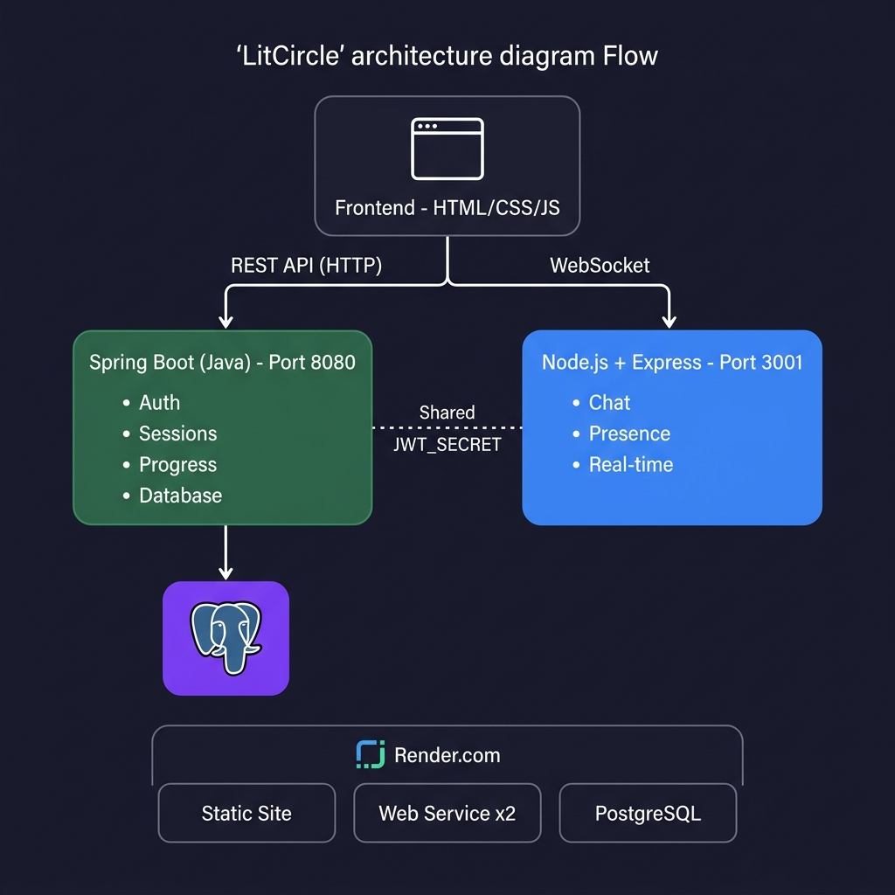
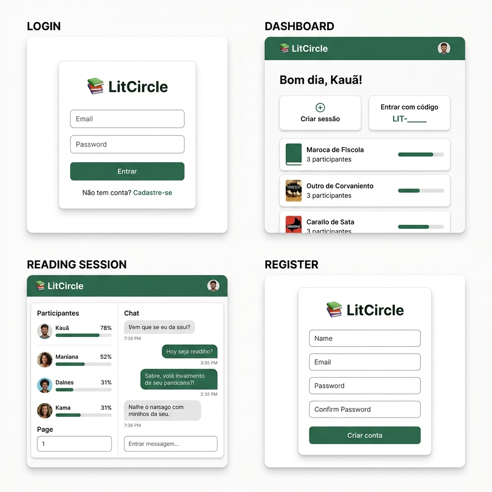

# 📚 LitCircle

> Plataforma de clube de leitura colaborativo com sessões em tempo real, rastreamento de progresso e chat.



---

## 🎯 O que é o LitCircle?

Um sistema onde amigos criam sessões de leitura compartilhadas, acompanham o progresso de cada participante e conversam em tempo real — tudo em uma única plataforma.

**Problema:** Pessoas que leem juntas não têm ferramenta que una sessões sincronizadas, progresso e chat.  
**Solução:** O LitCircle resolve isso com dois backends desacoplados e um frontend leve.

---

## 🏗️ Arquitetura

```
[Frontend — HTML/CSS/JS]
      │           │
      │ REST      │ WebSocket
      ▼           ▼
[Spring Boot]   [Node.js + Socket.IO]
  porta 8080      porta 3001
      │
      ▼
[PostgreSQL]
```

| Camada | Tecnologia | Responsável |
|--------|-----------|-------------|
| Frontend | HTML + CSS + JavaScript puro | Kauã |
| Backend REST | Java 21 + Spring Boot 3 | Rafael |
| Backend Real-time | Node.js 20 + Express + Socket.IO | Kauã |
| Banco de dados | PostgreSQL 15 | Rafael |
| Deploy | Render.com (100% gratuito) | Ambos |

**Por que dois backends?** Spring Boot cuida dos dados permanentes (auth, sessões, banco). Node.js cuida do tempo real (chat, presença). Eles compartilham a mesma `JWT_SECRET` para autenticação.

---

## 📸 Wireframes



---

## 🚀 Como executar localmente

**Pré-requisitos:** Node.js 20+, Java 21+, PostgreSQL 15+  
**Guia completo de instalação:** [docs/14-setup-ambiente.md](docs/14-setup-ambiente.md)

```bash
# 1. Clonar
git clone git@github.com:devkauapimentel/LitCircle.git
cd LitCircle

# 2. Criar banco
sudo -u postgres createdb litcircle

# 3. Backend Java (terminal 1)
cd backend-java
cp .env.example .env        # editar com suas credenciais
./mvnw spring-boot:run      # porta 8080

# 4. Backend Node (terminal 2)
cd backend-node
cp .env.example .env
npm install
npm run dev                  # porta 3001

# 5. Frontend (terminal 3)
cd frontend
# Abrir index.html com Live Server do VSCode (porta 5500)
```

---

## 📖 Documentação

### Para começar (leiam primeiro)

| # | Documento | O que explica |
|---|-----------|---------------|
| 1 | **[Manifesto](docs/01-manifesto.md)** | Regras da equipe, cultura, filosofia |
| 2 | **[Setup do ambiente](docs/14-setup-ambiente.md)** | Instalar Git, Node, Java, PostgreSQL |
| 3 | **[Git Workflow](docs/15-git-workflow.md)** | Branches, commits, PRs |
| 4 | **[Issues](docs/17-issues-github.md)** | 26 issues prontas para o GitHub Projects |

### Referência técnica (consultem quando precisar)

| # | Documento | O que explica |
|---|-----------|---------------|
| 5 | [Stack e ADRs](docs/05-stack-e-decisoes.md) | Tecnologias escolhidas e por quê |
| 6 | [Integração Java+Node](docs/06-integracao-java-node.md) | Como os backends se comunicam |
| 7 | [Modelo de dados](docs/07-modelo-de-dados.md) | 4 tabelas com SQL pronto |
| 8 | [Contrato de API](docs/08-contrato-de-api.md) | Rotas REST e eventos WebSocket |
| 9 | [Deploy](docs/09-deploy.md) | Deploy 100% grátis no Render.com |
| 10 | [Cronograma](docs/18-cronograma.md) | Roadmap de 8 semanas |

### Outros

| # | Documento | O que explica |
|---|-----------|---------------|
| 11 | [Requisitos](docs/03-requisitos-funcionais.md) | 7 funcionalidades do MVP |
| 12 | [Aprendizado](docs/12-guia-de-aprendizado.md) | O que estudar e quando |
| 13 | [Contribuição](docs/11-guia-de-contribuicao.md) | PRs, code review |
| 14 | [Wireframes](docs/19-wireframes.md) | Todas as telas (ASCII) |
| 15 | [Glossário](docs/16-glossario.md) | Termos técnicos |

---

## 📂 Estrutura do projeto

```
LitCircle/
├── frontend/                  ← Kauã
│   ├── index.html             ← Ponto de entrada
│   ├── config.js              ← URLs dos backends
│   ├── style.css              ← Estilos globais
│   ├── pages/
│   │   ├── login.html
│   │   ├── register.html
│   │   ├── dashboard.html
│   │   └── session.html
│   └── js/
│       ├── api.js             ← Funções fetch() para Spring Boot
│       ├── auth.js            ← Login, logout, token
│       ├── chat.js            ← Socket.IO client
│       └── router.js          ← Navegação entre páginas
│
├── backend-java/              ← Rafael
│   ├── src/main/java/.../
│   │   ├── controller/        ← Recebe requisições HTTP
│   │   ├── service/           ← Regras de negócio
│   │   ├── repository/        ← Acessa o banco
│   │   ├── model/             ← Entidades JPA
│   │   ├── dto/               ← Objetos de transferência
│   │   ├── security/          ← JWT + Spring Security
│   │   └── config/            ← CORS, beans
│   ├── src/main/resources/
│   │   ├── application.properties
│   │   └── db/migration/      ← SQLs do Flyway
│   ├── .env.example
│   └── pom.xml
│
├── backend-node/              ← Kauã
│   ├── src/
│   │   ├── index.js           ← Servidor Express + Socket.IO
│   │   ├── middleware/
│   │   │   └── auth.js        ← Validação JWT
│   │   └── handlers/
│   │       └── chat.js        ← Lógica do chat
│   ├── .env.example
│   └── package.json
│
├── docs/                      ← Documentação completa
├── assets/                    ← Imagens (wireframes, arquitetura)
├── .gitignore
├── PROJETOS-FUTUROS.md
└── README.md                  ← ESTE ARQUIVO
```

---

## 👥 Equipe e divisão de trabalho

### Rafael — Backend Java (Spring Boot)

| O que faz | Exemplos |
|-----------|----------|
| Cria rotas REST | `/api/auth/login`, `/api/sessions` |
| Modela o banco | Tabelas, migrations, índices |
| Implementa regras de negócio | Validação, bcrypt, JWT |
| Gerencia persistência | JPA, Flyway, PostgreSQL |

**Issues do Rafael:** #4, #5, #6, #7, #8, #9, #13, #14, #15, #16, #17, #21

### Kauã — Frontend + Backend Node.js

| O que faz | Exemplos |
|-----------|----------|
| Cria todas as telas | Login, dashboard, sessão |
| Consome a API REST | `fetch()` para Spring Boot |
| Implementa chat real-time | Socket.IO no Node.js |
| Gerencia autenticação no front | Token, redirecionamento |

**Issues do Kauã:** #2, #3, #10, #11, #12, #18, #19, #20, #22, #23, #26

**Issues compartilhadas:** #1, #5, #24, #25

---

## 🔄 Workflow

```
1. Pega issue do board (WIP = 1)
2. Cria branch: git checkout -b feature/nome-da-issue
3. Implementa + testa localmente
4. Commit: git commit -m "feat: descrição"
5. Push: git push origin feature/nome-da-issue
6. Abre Pull Request no GitHub
7. Parceiro revisa e aprova
8. Merge na main
9. Próxima issue
```

---

## 🛡️ Regras

1. **Nunca commit direto na `main`** — sempre via Pull Request
2. **`.env` nunca vai pro git** — use `.env.example`
3. **WIP = 1** — termine uma issue antes de pegar outra
4. **45 min travado** → documenta o problema → chama o parceiro
5. **Todo PR precisa de review** do outro

---

## 📅 Cronograma

| Semana | Milestone | Issues |
|--------|-----------|--------|
| 1 | v0.1 — Esqueleto | #1 a #5 |
| 2-3 | v0.2 — Autenticação | #6 a #12 |
| 4-5 | v0.3 — Sessões | #13 a #20 |
| 6-7 | v0.4 — Chat | #21 a #23 |
| 8 | v0.5 — Deploy | #24 a #26 |

**Detalhes:** [docs/18-cronograma.md](docs/18-cronograma.md)

---

## 📜 Licença

MIT
